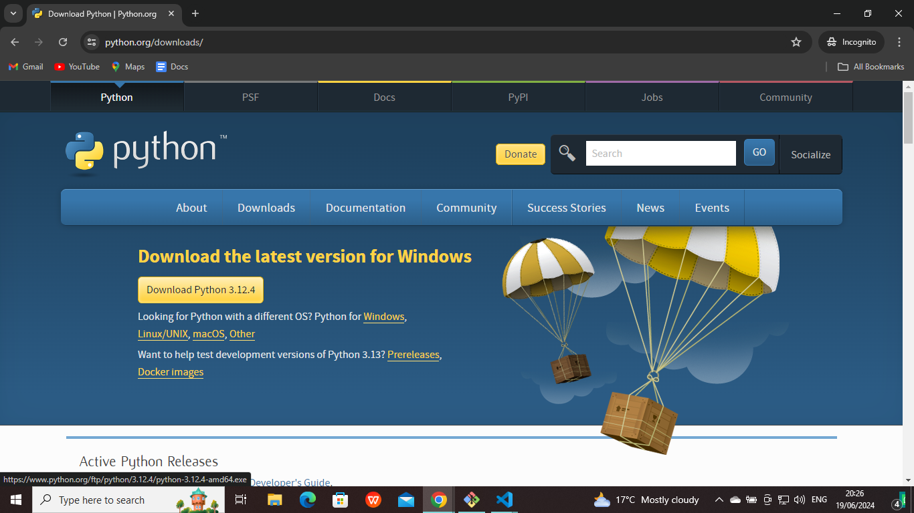
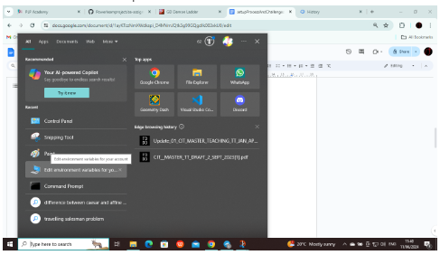
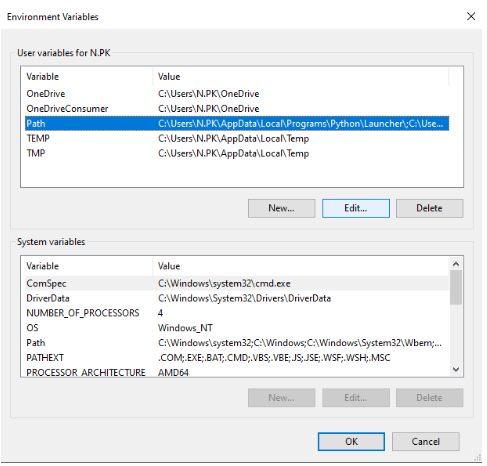
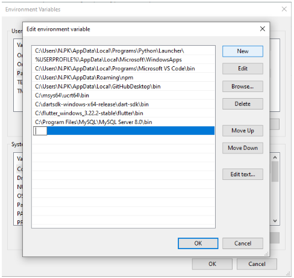
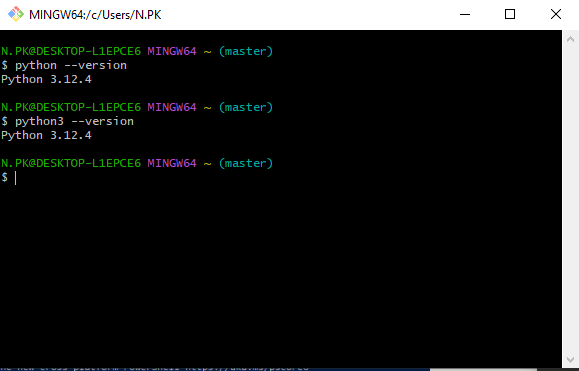

# SE-Assignment-6
Assignment: Introduction to Python  
Instructions:
Answer the following questions based on your understanding of Python programming. Provide detailed explanations and examples where appropriate.

Questions:

## 1. Python Basics
**What is Python, and what are some of its key features that make it popular among developers? Provide examples of use cases where Python is particularly effective.**

Python is a high-level programming language that is indentation-sensitive.

### It is popular among developers because:
- It is versatile, i.e. it can be used in web apps, mobile applications, data analysis, and more.
- Its syntax is simple, thus Python is easier to learn than other programming languages.
- It has easy code readability, thus errors are easier to find.

[Source](https://medium.com/@innvonixtechsolutions/why-python-is-so-popular-even-though-its-super-slow-cedfa2b8fe68)

### Examples of use cases where Python is particularly effective:
- Scripting and automation of file management, data processing and data extraction.
- Making web applications.
- Data analysis.

[Source](https://www.freecodecamp.org/news/what-is-python-best-for/)

## 2. Installing Python
**Describe the steps to install Python on your operating system (Windows, macOS, or Linux). Include how to verify the installation and set up a virtual environment.**

### Installing Python for Windows
- Visit the [official download website for Python](https://www.python.org/downloads/).
- Click on the 'Download Python [latest version that shows for you; 3.12.4 in my case below]' button.

- Doing so should download an installer.
- Run this installer and adjust the configurations to what you require.
- Go to 'Environment Variables' in your computer by searching it using th search bar. Click on 'Edit Environment Variables'. Click on ‘Path’ in User Variables, then ‘Edit’, or double-click ‘Path’. Click on ‘New’ to add a new path. Paste the Python installation path, then click ‘OK’. Click ‘OK’ again on the initial popup window to ensure changes are saved. You have now installed Python.

### Verifying installation
To ensure that Python has been install correctly, run `python --version` or `python3 --version` on your terminal.
If it has been installed correctly, the version of Python should be displayed.

### Installing virtual environment
You need to have installed pip beforehand. If you have not, run the following command to install pip:
`winget install pip`
To install a Python virtual environment, run the following commands:  
`python -m pip install virtualenv` or `python -m pip install venv`  
`python -m venv envname`  
To activate the virtual environment, run the following command:  
`python envname/Scripts/activate`  
Note that 'envname' is the name that you give to your environment. It can be any name.

## 3. Python Syntax and Semantics
**Write a simple Python program that prints "Hello, World!" to the console. Explain the basic syntax elements used in the program.**

      print("Hello, World!")

      # Output: Hello, World!

The `print` function in Python is a built-in function that accepts strings, variables, or a combination of both, and logs the accepted parameters onto the console. To input a comnination of strings and variables, one uses an f-string, as shown below:

      name = "World"
      print(f"Hello, {name}!")

      # Output: Hello, World!

## 4. Data Types and Variables
**List and describe the basic data types in Python. Write a short script that demonstrates how to create and use variables of different data types.**

### Basic data types in Python  
`str`: Short for 'string'. In Python, a string is a special type of array consisting of alphanumeric characters or symbols that are enclosed in quotation marks, e.g. `"AlvinKab"`.  
`int`: Short for 'integer'. An integer is a whole number, e.g. `18`.  
`float`: A float is a number with decimal point, e.g. `55.25`.  
`complex`: A complex number is a number that contains sqrt(-1). In Python, this is represented as `j`, e.g. `5+3j`  
`list`: A list is an unordered sequence of characters enclosed in square brackets. In most other programming languages, it is referred to as an array. `[0, 1, 1, 2, 3, 5, 8, 13, 21, 34, 55, 89, 144]` is an example of a Python list.  
`tuple`: A tuple is an ordered list, meaning that once a tuple is initialised, its contents cannot be changed. Its contents are usually enclosed in parentheses, e.g. `(7,7)`.  
`bool`: Short for 'Boolean'. Booleans are bi-conditional statements; either `True` or `False`.

### How to create and use variables of different data types
      # In Python, there is no need to include the data type when creating a variable.
      name = "Alvin"
      age = 18
      price = 55.25
      cmplx = 5+3j
      fibbo = [0, 1, 1, 2, 3, 5, 8, 13, 21, 34, 55, 89, 144]
      xycoord = (7,7)
      assignment = True

      print(f"My name is {name}. I am {age} years old. 30g of potato crisps cost Kshs {price} cts on average. I once learnt of complex numbers such as {cmplx}. The tenth number in the Fibbonacci sequence is {fibbo[9]}. If one plots a circle with the origin at the centre and a radius of 7 units, then one of the points located at the circumference of the circle will be {xycoord}. True or False: This assignment has been done: {assignment}")

      # Output: My name is Alvin. I am 18 years old. 30g of potato crisps cost Kshs 55.25 cts on average. I once learnt of complex numbers such as (5+3j). The tenth number in the Fibbonacci sequence is 34. If one plots a circle with the origin at the centre and a radius of 7 units, then one of the points located at the circumference of the circle will be (7, 7). True or False: This assignment has been done: True

## 5. Control Structures
**Explain the use of conditional statements and loops in Python. Provide examples of an `if-else` statement and a `for` loop.**

Conditional statements are statements where the program abandons one set of statements in favour of executing another based on whether certain conditions are met, or where a set of statements is executed (based on whether certain conditions are met).

      number = 40

      if number > 50:
         print("The number is greater than 50")
      elif number < 50:
         print("The number is less than 50")
      else:
         print("The number is 50")

      # Output: The number is less than 50

Loops are statements where the program executes a set of statements repeatedly based on given parameters and conditions until the conditions are no longer met.

      fibbo = [0, 1, 1, 2, 3, 5, 8, 13, 21, 34, 55, 89, 144]

      for i in range(len(fibbo)):
         suffix = {i == 0: "st", i == 1: "nd", i == 2: "rd"}.get(True, "th")
         print(f"{fibbo[i]} is the {i+1}{suffix} number in the Fibbonacci sequence")

      # Output
      # 0 is the 1st number in the Fibbonacci sequence
      # 1 is the 2nd number in the Fibbonacci sequence
      # 1 is the 3rd number in the Fibbonacci sequence
      # 2 is the 4th number in the Fibbonacci sequence
      # 3 is the 5th number in the Fibbonacci sequence
      # 5 is the 6th number in the Fibbonacci sequence
      # 8 is the 7th number in the Fibbonacci sequence
      # 13 is the 8th number in the Fibbonacci sequence
      # 21 is the 9th number in the Fibbonacci sequence
      # 34 is the 10th number in the Fibbonacci sequence
      # 55 is the 11th number in the Fibbonacci sequence
      # 89 is the 12th number in the Fibbonacci sequence
      # 144 is the 13th number in the Fibbonacci sequence

## 6. Functions in Python
**What are functions in Python, and why are they useful? Write a Python function that takes two arguments and returns their sum. Include an example of how to call this function.**

A function is a block of organised, reusable code that is used to perform a single related action. Functions provide better modularity for your application and a high degree of code reusing.

[Source](https://www.tutorialspoint.com/python/python_functions.htm)

      def sumOfTwo(num1, num2):
         return num1 + num2

      print(sumOfTwo(6, 3))

      # Output: 9

## 7. Lists and Dictionaries
**Describe the differences between lists and dictionaries in Python. Write a script that creates a list of numbers and a dictionary with some key-value pairs, then demonstrates basic operations on both.**

Python lists store data values independently while Python dictionaries store data values in key-value pairs.

      fibbo = [0, 1]

      for i in range(2, 16):
         fibbo.append(fibbo[i-1] + fibbo[i-2])

      print(fibbo)
      # Output: [0, 1, 1, 2, 3, 5, 8, 13, 21, 34, 55, 89, 144, 233, 377, 610]

      fibbo16 = fibbo.pop()

      print(fibbo)
      # Output: [0, 1, 1, 2, 3, 5, 8, 13, 21, 34, 55, 89, 144, 233, 377]
      print(fibbo16)
      # Output: 610

      compilation = {
         "name": "Alvin",
         "age": 18,
         "price": 55.25,
         "cmplx": 5+3j,
         "xycoord": (7,7),
         "assignment": True
      }

      print(compilation["assignment"])
      # Output: True
      print(compilation["price"])
      # Output: 55.25

## 8. Exception Handling
**What is exception handling in Python? Provide an example of how to use `try`, `except`, and `finally` blocks to handle errors in a Python script.**

In Python, exception handling is the ability of Python to handle errors or things that go wrong in the code in general.

      fibbo = [0, 1, 1, 2, 3, 5, 8, 13, 21, 34, 55, 89, 144, 233, 377, 610]

      try:
         i = int(input("Enter a number: "))
         print(fibbo[i])
      except IndexError:
         print("Out of range.")
      finally:
         print(fibbo)

      # Input: 6
      # Output:
      # 8
      # [0, 1, 1, 2, 3, 5, 8, 13, 21, 34, 55, 89, 144, 233, 377, 610]

      # Input: 20
      # Output:
      # Out of range.
      # [0, 1, 1, 2, 3, 5, 8, 13, 21, 34, 55, 89, 144, 233, 377, 610]

## 9. Modules and Packages
**Explain the concepts of modules and packages in Python. How can you import and use a module in your script? Provide an example using the `math` module.**

A module is a file containing a set of functions one would like to include in their application.
A package contains all the files one needs for a module.

[Source 1](https://www.w3schools.com/python/python_modules.asp)  
[Source 2](https://www.w3schools.com/python/python_pip.asp)

### To import a module, one includes the following in their code: 
`from package import module`  
or  
`import module as altModuleName`

### Example using `math` module
      import math as maths

      num1 = int(input("Enter a number: "))
      num2 = int(input("Enter another number: "))
      num3 = int(input("Enter another number: "))

      print(f"G.C.D.: {maths.gcd(num1, num2, num3)}")
      print(f"Sine of your first number: {maths.sin(num1*(maths.pi/180))}")
      print(f"Cosine of your second number: {maths.cos(num2*(maths.pi/180))}")
      print(f"Tangent of your third number: {maths.tan(num3*(maths.pi/180))}")
      print(f"Value of π: {maths.pi()}")

      # Input
      # Enter a number: 30
      # Enter another number: 60
      # Enter another number: 90
      # Output
      # G.C.D.: 15
      # Sine of your first number: 0.49999999999999994
      # Cosine of your second number: 0.5000000000000001
      # Tangent of your third number: 0.9999999999999999
      # Value of π: 3.141592653589793

## 10. File I/O
**How do you read from and write to files in Python? Write a script that reads the content of a file and prints it to the console, and another script that writes a list of strings to a file.**

### Reading from and writing to files in Python
We use the `open()` function that takes two parameters, the first one being the `path` to where the file to be opened is located, and the second one being the mode it is to be opened.
`"r"`: Read-only mode. `write()` cannot be used.
`"w"`: Upon running `write()`, new content overwrites previous file content.
`"a"`: Upon running `write()`, new content is added to previous file content.

### Script 1: Reading file
      reading = open("textfile1.txt", "r")
      text = reading.read()
      print(text)
      reading.close()

      # Ensure both the Python file and the text file are under the same folder, otherwise add the entire path. If accessing the text file fron the Python file requires navigating upwards, add `../` for every folder you exit.

### Script 2: Writing a list of strings to a file
      writing = open("textfile2.txt", "w")

      i = 1
      while i <= 10:
         writing.write(f"String {i}\n")

      writing.close()

      # If the text file does not exist, it will be created at the specified path
